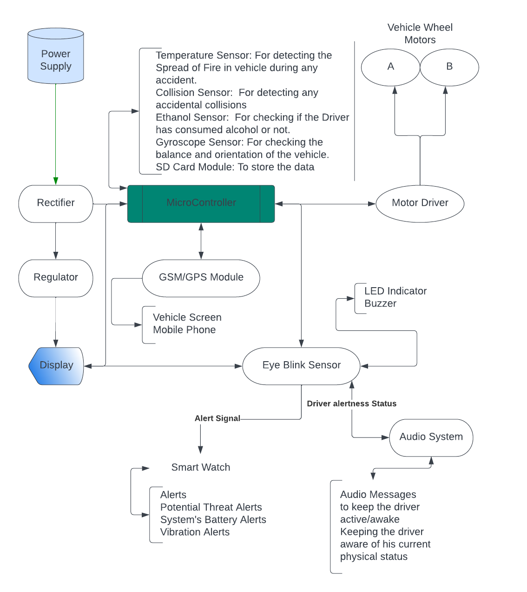

# Driver-Safety-System-using-Arduino
* System's Overview: [`Overview`](./PrjtOverview.png)

* System's Flowchart:

  

* [VehicleModule](./VehicleModule/) has code related to the our car simulator part with various sensors
-> All pin connections are mentioned in the code 
-> Install LiquidCrystal_I2C library from Arduino IDE for interfacing the LCD 

* [HeadKitModule](./HeadKitModule/) has code related to the wearable head kit designed by us.
-> All pin connections are mentioned in the code. 
-> Install TMRpcm,SD,SPI,SoftwareSerial library from Arduino IDE or from github for interfacing with SD card module for audio messages, for Text Messaging/Calling using SIM800L V2 module. 

* [Circuit Photo](./Circuit%20Photo/)
-> Contains demo circuit diagram, the extact pin connections are not used in the project and in the code. 
-> Its aim is just to show the hardware connection layout for our project. 

* Alert message is the audio message used to alert the driver
* DHT_Library is for interfacing with the Temperature sensor
* [`driverSafetySystem`](./driverSafetySystem.pdf) is the final report of my system.
* Live Project Demonstration: https://youtu.be/lGitoWjo3aw